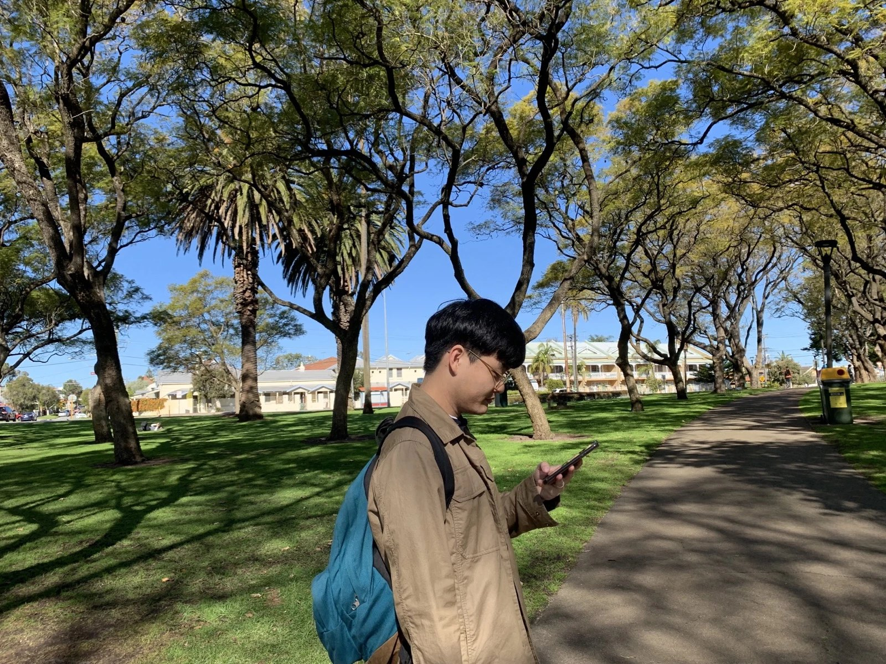

## Welcome to GitHub Pages

Hi, my research interests include Language Acquisition, Computational Linguistics, and Bilingualism.

## Education
Korea University, Seoul, Korea
Bachelor of Arts, Linguistics, Feb 2021

University of Illinois, Urbana-Champaign, IL, USA
Linguistics, Exchange Student, Fall 2018

## LANGUAGE PROFICIENCY
Native in both English and Korean
Able to speak Spanish (DELE A1)
iBT TOEFL: 114 (Reading: 30, Listening: 30, Speaking: 26, Writing: 26)

## HONORS AND AWARDS
Certificate of Achievement, 65th Medical Brigade, Korean Augmentation Troops to the United States Army (KATUSA), 2017

Commandants List, Wightman NCO Academy, Korean Augmentation Troops to the United States Army (KATUSA), 2016

Special Scholarship, Korea University, 2015
 
## CLASS PROJECT EXPERIENCE

1. Muller-Lyer Illusion Experiment, Spring 2020
- Analyzed the effect of constant-stimuli methodology.
- Conducted further experiment to find out how concentration affects the result.
2. Color Themes in Dubliners by James Joyce Spring 2020
- Implemented a Python code for extracting color words from Dubliners.
- Picked one important color that recurs in more than one story and analyzed its significance to the collection as a whole. 

## PROFESSIONAL EXPERIENCE

1. Brigade Translator, 65th Medical Brigade  FEB. 2017 - JUN. 2018
- Change of Responsibility\hfill MAY. 10, 2018
- Change of Command \hfill MAY. 31, 2018
2. Assistant, Host Nations Affairs, 65th Medical Brigade  DEC. 2016 - APR. 2018
- 38th Parallel Healthcare Training Symposium,  NOV. 2017
- Managed RSVP and reception list for the Korean Attendees. 
3. Managing Assistant, The Core Paradigm  JUN. 2017- JUN. 2019
- Developed new chart to keep track of students' homework status. 
- Have counseling experience with parents and students.

## TEACHING EXPERIENCE

1. Teacher, Read 101  DEC. 2019 - present
- English Academy specializing in phonics, reading comprehension, and writing. Engaged in active discussion with children from the age of 5 to 14. Proofread their writing according to their English proficiency.

2. Teaching Assistant, The Core Paradigm  JAN. 2015 - JUN. 2019
- English Academy specializing in the TOEFL. Taught reading comprehension and vocabulary to Korean students from middle school to high school.

## TECHNOLOGY SKILLS 

Programming Languages: Python

